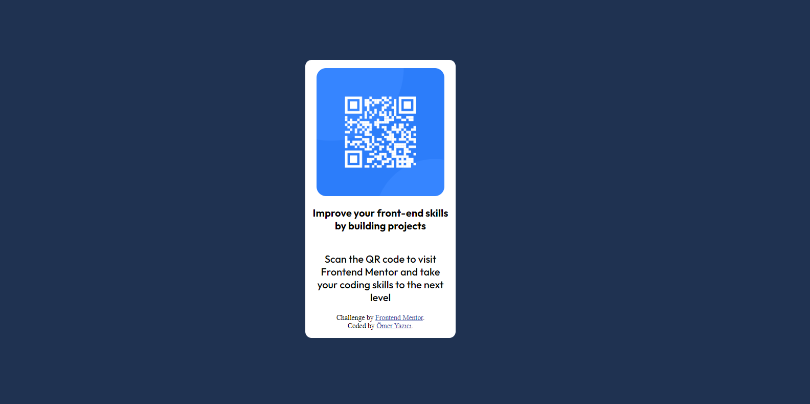

# Frontend Mentor - QR code component solution

This is a solution to the [QR code component challenge on Frontend Mentor](https://www.frontendmentor.io/challenges/qr-code-component-iux_sIO_H). Frontend Mentor challenges help you improve your coding skills by building realistic projects.

## Table of contents

- [Overview](#overview)
  - [Screenshot](#screenshot)
  - [Links](#links)
- [My process](#my-process)
  - [Built with](#built-with)
  - [What I learned](#what-i-learned)
  - [Useful resources](#useful-resources)
- [Author](#author)

## Overview

### Screenshot



### Links

- Solution URL: [Github](https://github.com/omeryaz/qrcomponent)
- Live Site: [QR Component](https://omeryaz.github.io/qrcomponent/)

## My process

### Built with

- Semantic HTML5 markup
- CSS custom properties
- Flexbox

### What I learned

```html

<p style="font-family: 'Outfit', sans-serif;text-align: center;font-weight: 700;">
    Improve your front-end skills by building projects
</p>

// Discovered font-weight.

```

```css
html, body {
  margin: 0;
  padding: 0;
}  

// fixes the default white padding in some browsers. (in my case Brave)

height: 100vh; 

// vh value provides a way to make a blockline cover all of the page. (height in the case, vw fo width)

border-radius: 15px;

// Using border-radius to make the corners smoother.

```

### Useful resources

- [Flexbox Crash Course 2022](https://www.youtube.com/watch?v=3YW65K6LcIA)
- [Flexbox Froggy Game](https://flexboxfroggy.com/) - Both of these resources taught me everything I know about flexbox which helped me immensely build this qr code page.

## Author

- Frontend Mentor - [@omeryaz](https://www.frontendmentor.io/profile/omeryaz)

**Note: Delete this note and add/remove/edit lines above based on what links you'd like to share.**
